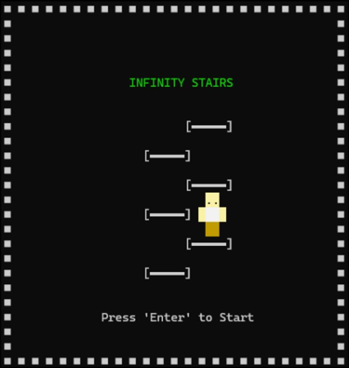
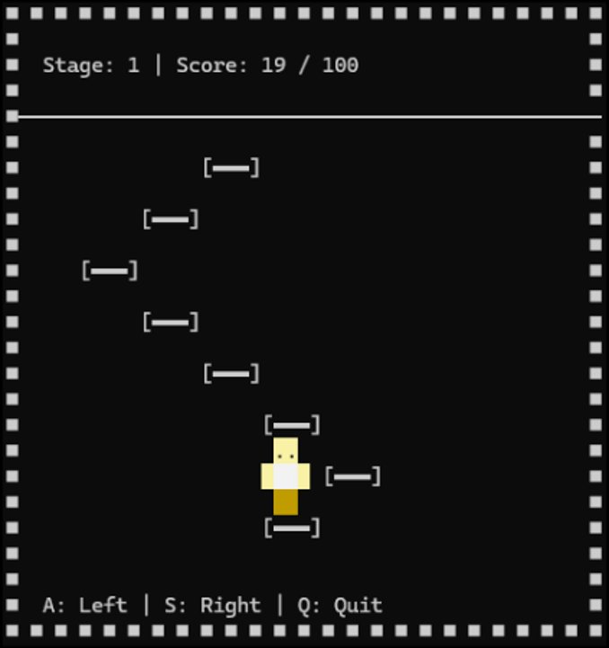
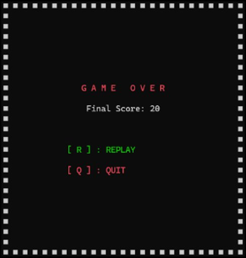

# 🪜 Infinity Stairs

Windows 콘솔(Console) API로 만든 ASCII 계단 점프 게임입니다.
캐릭터가 좌우로 갈라지는 계단을 정확히 골라 밟으며 점수를 쌓고, **100점을 달성하면 승리**합니다.

---

## 🎮 게임 방법

| 키 | 동작 |
|---|---|
| `A` | 왼쪽 계단으로 이동 |
| `S` | 오른쪽 계단으로 이동 |
| `Q` | 게임 종료 |
| `R` | 게임오버 후 재시작 |

계단이 갈라지는 방향과 다른 키를 누르면 게임오버 처리됩니다. 메인 메뉴에서 `Enter`를 누르면 시작합니다.

---

## 🛠 사용 기술

| 분류 | 내용 |
|---|---|
| 언어 | C++ |
| 플랫폼 | Windows Console API (`windows.h`, `conio.h`) |
| 렌더링 | 콘솔 스크린 버퍼 2개를 교체하는 더블 버퍼링 방식으로 깜빡임 방지 |
| 개발 환경 | Visual Studio 2022 (PlatformToolset v145), x64/x86 |

---

## 🏗 구조

```
Project1/
├── 1.cpp                    # 게임 전체 로직 (메뉴, 게임 루프, 렌더링)
├── Project1.slnx             # Visual Studio 솔루션 파일
├── Project1.vcxproj          # 프로젝트 설정
└── Project1.vcxproj.filters  # VS 탐색기 파일 분류 정보
```

### 핵심 구현 포인트
- **더블 버퍼링**: `CreateConsoleScreenBuffer`로 화면 버퍼 2개를 만들고 `SetConsoleActiveScreenBuffer`로 교체하며, 화면이 깜빡이지 않게 렌더링합니다.
- **충돌(겹침) 처리**: 캐릭터의 몸통·다리 위치와 같은 좌표의 계단은 그리지 않아, 캐릭터가 계단 위에 자연스럽게 서 있는 것처럼 보이게 합니다.
- **색상 표현**: 콘솔 텍스트 속성(`SetConsoleTextAttribute`)으로 캐릭터 피부/몸통/계단 색을 구분합니다.

---

## ▶️ 실행 방법

Visual Studio에서 `Project1.slnx`를 열고 x64(또는 x86) 구성으로 빌드 후 실행하면 됩니다.

> Windows 전용 API(`windows.h`, `conio.h`)를 사용하기 때문에 Windows + Visual Studio 환경에서만 빌드됩니다.

---

## 📷 스크린샷

| 1. 시작 화면 | 2. 게임 진행 중 | 3. 실패 (Game Over) | 4. 성공 |
|---|---|---|---|
|  |  |  |  |
